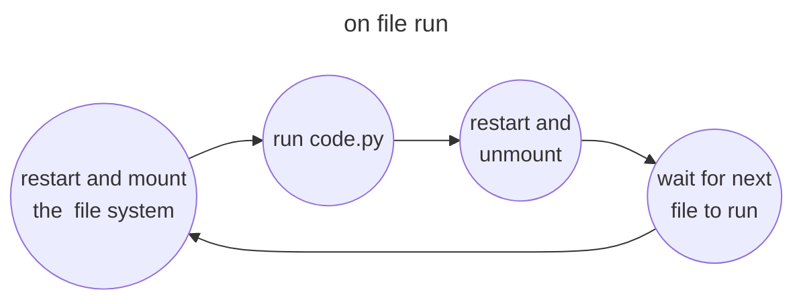
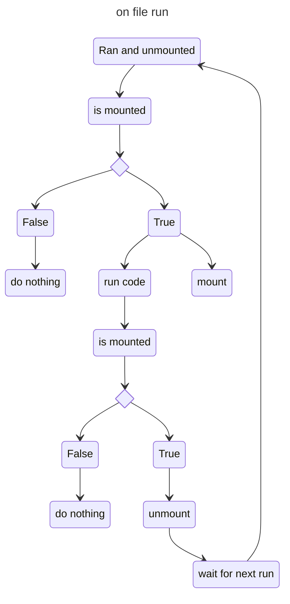

- [dead reckoning reddit](https://www.reddit.com/r/robotics/comments/14p839t/have_anyone_tinkered_with_mpu_6050/)

## Ideas for rebooting to run a file in "data mode"

- CLass
- Have a singleton type class that just grabs the state of a yaml file or text called `state.txt` and at the beginning you just call a class method .

doesnt work because i need to mount internally before changing things in the state file.

- Flip between states on restart

- this is done by having a state txt file that is modified to check weather in the last run the system was mounted 
- this basically means that on every restart we just flip the last state this also means there would have to be 2 restarts which could be done by having one restart at the beginning of the file that's conditional on the state being unmounted and one at the end checking that the file is mounted
