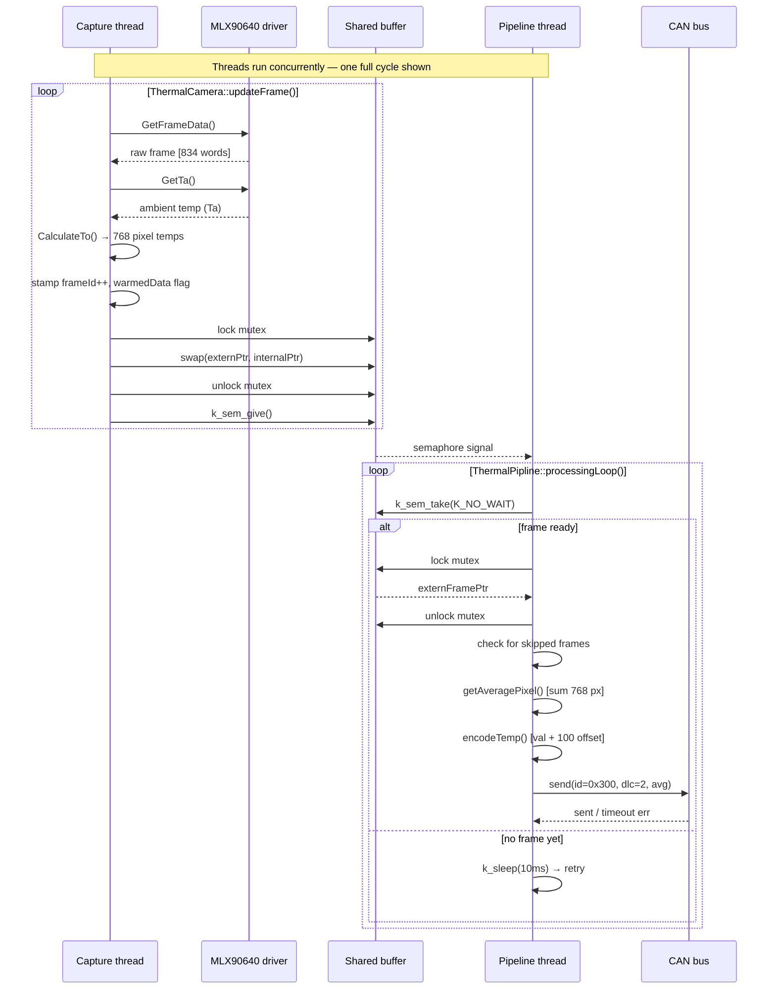

## Introduction 

- Introduce the problem and how the design constraints are open ended
- Design constrains
	- 

## Design Approach 
- THIS Slide is about the philosophy behind the design
	- Wanted to create a Reusable piece of code that could be ported by anyone who has learned C++ as getting and processing the temperature data from the sensor will be handled by the 
- Note that it was an open ended problem and a bear metal solution would have been easier to implement 

### Class Design 
- Uses a linux UNIX interface structure with each class to match standard 
	- UNIX is the open(innit), close, IOCTL
	- Maybe not true becasue im using more than IOCTL

- The ThermalPipeline and ThermalCamera classes were seperated so that processing functionality is separate from the driver. 
	- This makes sense as if you wanted to use the thermal camera lets say to detect overheating on a battery system you would simply replace parts of the ThermalPipline class while the camera wrapper remains untouched. 

### Concurrency implementation 

### Future development 
- Visualization tool
	- INCLUDE A VISUAL FROM MY A* PROGRAM

# Slides outline 

## Introduction 
- Talk about the problem and the board and its capabilities 
- TALK ABOUT THE COMUNICATION PROTOCOLS 
	- I2C, USART, CAN 

## Design Philosophy 
- Short slide 
- Talk about the goals of the project 
	- I wanted to make a reuable design so the sensor wrapper could be used in future projects EG failure testing for battery system, "INSERT OTHER IDEA"

## Overview Class design 
- SECOND BEEFIEST SLIDE
- Use the layering diagram 
- Talk about the general role of each class and why it was chosen to be implemented 

## Thermal Camera Design overview 
- BEEFIEST SLIDE 
- talk about the double buffering 
	- Can talk about the pros and cons of simply copying data to the consumer 

> [!note] 
> Talking about the mutex or semaphore would be a mistake as the people watching the presentation are not technically knowledgeable about that kind of memory management 

## Thermal Pipeline 
- SHORT SLIDE
- talk very shortly about thermal pipline 
	- "thermal pipline acts like a container for all of the separate functionalities of the board linking the CAN process and the Camera wrapper while still having its own purpose processing the Camera data."
- Mainly use this as a transition into  a short overview of the sequence diagram 
	- MAYBE DONT DO THIS MAYBE TO DETAILED REMEBER AUDIENCE 

## Future implementations
- Integrate OS side logging software to get data from the DEBUG messages from the sensor for preliminary testing integrate this with the visualization tool 
- design more complex algorithms to parse data from the sensor eg figure 1 in the 